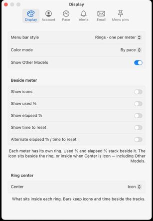
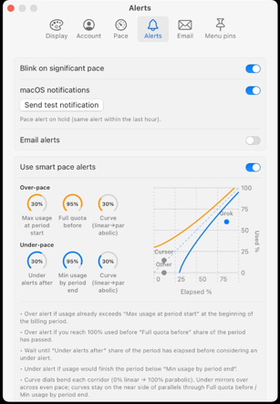
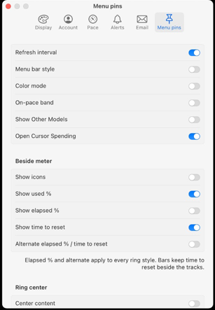

# QuotAI

macOS **Swift** menu-bar app for Cursor Spending quota (Cursor Models + Grok Bot).

**Stack:** Swift / SwiftUI `MenuBarExtra`, XcodeGen, macOS 14+  
**Status:** live Connect fetch wired — open app to verify meters  
**License:** [MIT](LICENSE)  
**Wayfinder:** `.scratch/quotai/map.md`  
**Product / tech:** `docs/pr.md`, `docs/tech-specs.md`

## Screenshots

Menu bar rings (used % and time to reset). Nested Cursor blinks between Models and Other; a smart pace hit blinks that quota ring:


[Original recording](docs/screenshots/menu-rings.mov)

Display (ring style, beside-meter labels, ring center):



Smart pace alert corridors:



Menu pins, including Open Cursor Spending:



## Build

```bash
make project   # xcodegen generate
make test      # QuotAICore unit tests
open QuotAI.xcodeproj
```

## Release (DMG)

```bash
make dmg        # package only → dist/QuotAI-<version>.dmg
make release    # run tests, then package
```

Optional for Gatekeeper-safe distribution:

```bash
export QUOTAI_SIGN_IDENTITY='Developer ID Application: …'
export QUOTAI_NOTARY_PROFILE='quotai-notary'
```

Production code lives only under `QuotAI/` and `QuotAICore/` (Swift). The Python script under `.scratch/quotai/poc/` is a **throwaway** API proof, not the app.
