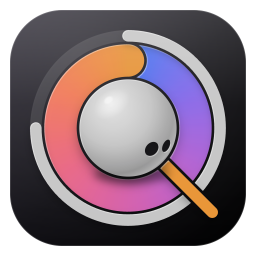

# QuotAI app icon progression

Visual history of the clear-b / Icon Studio packs. Full archives live under [`archive/`](archive/) and shipped flat packs under [`0.9.2/`](0.9.2/), [`0.9.3/`](0.9.3/). Thumbnails here are 128px (and 256px siblings in [`progression/`](progression/)).

| Step | When | App / pack | Tile | Scale | Notes |
|------|------|------------|------|-------|-------|
| 1 | 2026-10-09 | v4 pack → ~0.9.0 | early flat | — | Pre-studio `v4pack.py` export |
| 1b | 2026-10-09 | **v0.9.1** | clear-b dark | — | First shipped clear-b Dock / About icon |
| 2 | 2026-10-09 | studio pack 1 | frosted | 1.28 | Sphere mascot; frosted clear tile |
| 3 | 2026-10-09 | **v0.9.2** / pack 2 | black charcoal `#2B2833`→`#000` | 1.28 | Shipped sphere + black tile |
| 4 | 2026-10-10 | pack 3 (trial) | purple-black `#390424`→`#1B042F` | 1.35 | Same-day trial before pack 4 |
| 5 | 2026-10-10 | **v0.9.3** / pack 4 | purple-black `#390424`→`#1B042F` | 1.35 | Current live pack |

---

## 1 — v4 pack (early flat)

Source: [`archive/0.9.0-v4pack.zip`](archive/0.9.0-v4pack.zip)

---

## 1b — v0.9.1 shipped

Restored from git `aea4044` (`docs/brand/app-icon-128.png`). Liquid-glass layer sources from this era remain under `../clear-b/liquid-glass/`.

---

## 2 — Studio pack 1 (frosted sphere)

- Scale **1.28**, tile **frosted**, look 130°, eye 1.5  
- Source: [`archive/studio-pack-1-frosted.zip`](archive/studio-pack-1-frosted.zip)

---

## 3 — v0.9.2 / studio pack 2 (black charcoal)

- Scale **1.28**, tile **black** `#2B2833` → `#000000`  
- Flat pack: [`0.9.2/`](0.9.2/) · zip: [`archive/0.9.2-studio-pack-2.zip`](archive/0.9.2-studio-pack-2.zip)

---

## 4 — Pack 3 trial (purple-black, scale 1.35)

- Scale **1.35**, tile **black** with purple `#390424` → `#1B042F`, look 122°, eye 1.4  
- Not shipped; kept as trial: [`archive/0.9.3-trial-pack-3.zip`](archive/0.9.3-trial-pack-3.zip)

---

## 5 — v0.9.3 / pack 4 (current)

- Scale **1.35**, same purple-black tile family as pack 3 (final studio export)  
- Live: `../clear-b/` · archive: [`0.9.3/`](0.9.3/) · zip: [`archive/0.9.3-pack-4.zip`](archive/0.9.3-pack-4.zip)

---

## Side-by-side (128px)

| 1 v4 | 1b 0.9.1 | 2 frosted | 3 0.9.2 | 4 trial | 5 0.9.3 |
|------|----------|-----------|---------|---------|---------|
|  |  |  |  |  |  |
